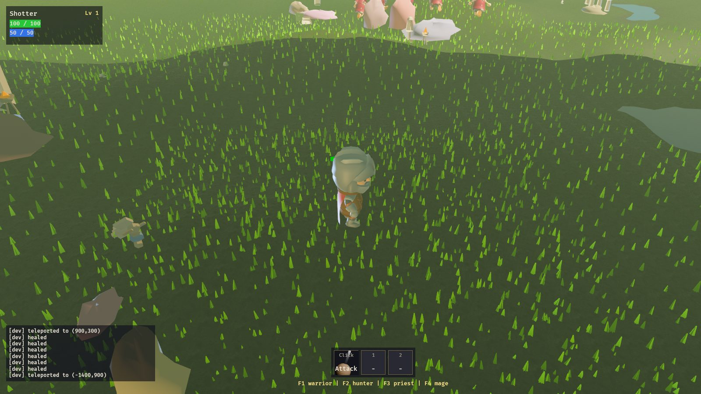
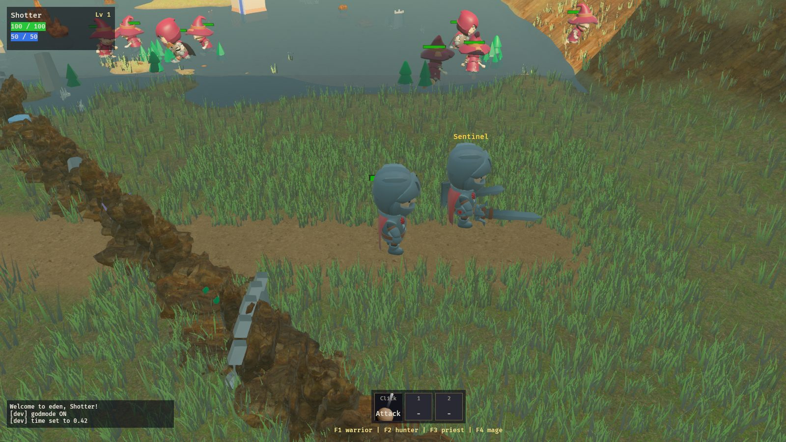
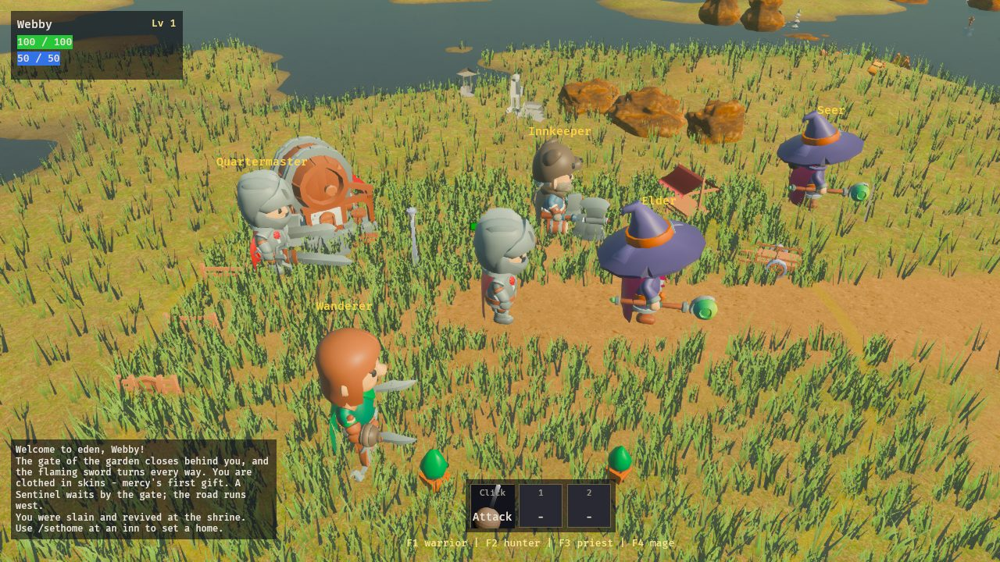

# Realism pass — 2026-09-14

Daniel's ask: "up the real-ness of the graphics by a factor of 4". This pass
covers the **environment** (terrain, grass, rocks, light, water). Characters
are still the stylized KayKit chibi rigs; see *Next pathways*.

| Before | After (desktop) | After (browser, WebGL2) |
|---|---|---|
|  |  |  |

## What changed and why

| Area | Before | After | Where |
|---|---|---|---|
| Terrain | One 1K tile × flat height palette → green carpet | 4 photoscanned CC0 layers (grass, dirt, cliff, sand) in texture arrays; slope-driven triplanar cliffs, height-aware blending, macro noise, two-scale tiling, mipmaps + 16x aniso | `terrain.wgsl`, `terrain_material.rs`, `terrain.rs::splat_for` |
| Terrain mesh | 192² quads (~40 u/quad) | 384² | `terrain.rs` |
| Grass | 3 wide saturated triangles | 18 thin curved blades per clump, root-to-tip gradient, hue variation, ~12% dry tips; 8-blade far LOD | `grass.rs::clump_mesh` |
| Rocks | 5×8 faceted domes, flat colour | 18×32 fractal-displaced, textured with the cliff layer (same shader, cliff forced on); GLTF rocks re-skinned too | `variety.rs::formation_mesh`, `terrain_material.rs::skin_rocks` |
| Light | Sun + 2 fake fill lights + flat ambient; sun straight overhead at noon | Procedural sky cubemap IBL (diffuse + mipmapped specular) per act; sun peaks ~55° so shadows read | `lighting.rs`, `atmosphere.rs` |
| Exposure | Bevy indoor default EV100 9.7 under a 22 klx sun (blown out → bloom veil) | Physical EV100 11.9, 75 klx sun, bloom 0.06, neutral grade (sat 1.15 vs 1.32) | `main.rs` camera, `lighting::look` |
| Fog | Density read as a wall at the new exposure; sun-glow term washed everything | ×0.3 density, no directional glow | `atmosphere.rs::fog_scale` |
| Contact shadows | none | SSAO (desktop only; WebGL2 has no compute) | `main.rs` setup |
| Water | Flat translucent blue pane | Dark, rippled normal map drifting over time, Fresnel sky reflections via IBL | `lighting.rs` water section |

## Tuning knobs (desktop, for screenshot iteration)
- `ANTEDILUVIA_LOOK="ev100,ibl,sun_lux"` — default `11.9,6000,75000`
- `ANTEDILUVIA_FOG=<mult>` — default `0.3`
- `ANTEDILUVIA_NO_SSAO=1`
- Dev console `time 0.42` pins mid-morning sun for comparable shots.

## Rebuilding textures
`scripts/build_terrain_arrays.py` downloads the Poly Haven 2K sets into the
gitignored `assets/textures/terrain_src/` and writes the committed stacked
arrays in `assets/textures/terrain/`. Layer order must match `terrain.wgsl`.

## Honest gaps (why this is not yet "4x" everywhere)
1. **Characters** are chibi KayKit models — the single biggest remaining
   realism limiter on screen.
2. **Trees/foliage** are Kenney/KayKit low-poly cones and blobs.
3. **Buildings/props** (KayKit village, propgen families) are flat-shaded.
4. Sky sphere is a 1×128 gradient (no clouds, no sun disc).
5. No real-time reflections or depth-based shoreline foam.

## Next pathways (ordered by on-screen impact)
1. **Realistic humans:** Blender 5.2 is installed. MPFB2 (MakeHuman for
   Blender; generated meshes are CC0) can batch-generate bodies headless →
   game_engine rig → GLB. Animations: retarget the existing Rig_Medium clips
   in Blender (bone-name map + bake), or CMU mocap BVH. Character creation
   sliders map directly onto MakeHuman macro targets (age/weight/muscle/
   proportions) — hundreds of real choices, not palette swaps.
   Dead ends already known: Quaternius itch.io downloads are gated; Mixamo
   needs an Adobe login.
2. **Trees:** Poly Haven has a small CC0 tree set; otherwise generate with
   Blender's Sapling Tree Gen headless and export LODs + alpha-card leaves.
3. **Props:** apply the triplanar material family (wood/plaster/stone
   variants) to KayKit buildings the way rocks are re-skinned now.
4. **Sky:** add a procedural cloud layer to the sky sphere and a sun disc,
   and feed the same function into `lighting::radiance` so IBL matches.
5. **Water:** depth-fade + shoreline foam need the depth prepass (desktop);
   on web, fake it from `terrain_height` vs water level in a vertex colour.
